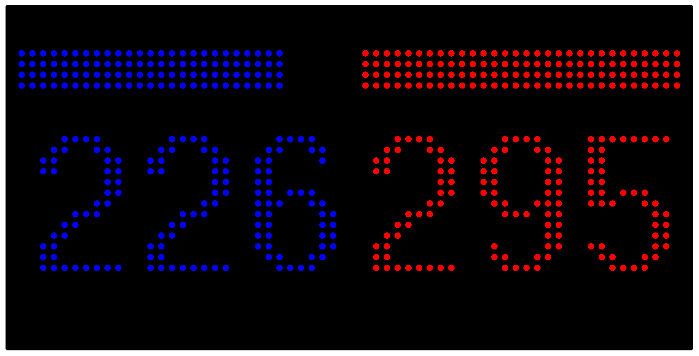

## Overview
This is a small but useful set of scripts to display live U.S. election results on a [Tidbyt](https://tidbyt.com/).  

Even if you don't have a Tidbyt, the script used to scrape election results could be useful for a variety of other applications, and it is set up to run as a simple Flask server. Alternatively, if you have different data you want to display on a Tidbyt, the script could be easily adjusted to pull data from any source - not just electoral votes.

## Setup
### Install Pixlet
In order to display live-updating results on a Tidbyt, you will need to install the Pixlet CLI. This will allow you to login to your Tidbyt account, get your device name, and push data to it. 
  
**The steps to install Pixlet are available in the [Tidbyt Documentation](https://tidbyt.dev/docs/build/installing-pixlet).**

Once you have installed the CLI, run the following commands to login and get your device ID:  
1. Login to your Tidbyt account `pixlet login`  
2. List available Tidbyt devices `pixlet devices`  

*Take note of the device ID, you'll need it soon*
  
### Activate Python environment and install dependencies

From the project directory, create and activate a virtual environment:  
`python3 -m venv venv`  
`source venv/bin/activate`  

Install project dependencies:  
`pip install -r requirements.txt`

### Set the environment variables

Open the `.env` file and include the following information:

1. Place the device ID you found earlier in the `TIDBYT_DEVICE_ID` variable.
2. Replace the `ELECTION_RESULTS_URL` variable with a stable election page you want to track.
3. Replace the selector strings with valid *BeautifulSoup* selectors that point to an element with the vote count.

**Selector example:**  -> `.party.dem`  

## System Design

I have had my Tidbyt for over a year, but this is my first time creating an app for it. I was a bit surprised by the process, which was not as straightforward as I would have imagined. For that reason, I want to share a bit of the experience for anyone else creating simple, one-off Tidbyt apps.  

First, the scripts are written in Starlark, which looks like Python but is much more constrained. The scripts do not actually run on the Tidbyt itself - they are rendered externally as gif or webp images and pushed to the device. This means you cannot rely on the Starlark script to continually poll fresh data - it needs to be continually re-run to provide fresh renders to the device.

They describe this in their [documentation](https://tidbyt.dev/docs/build/build-for-tidbyt), along with some examples.

I was also surprised to learn that you cannot deploy a private app without paying for their subscription, so my implementation utilizes the `push` feature which comes with some constraints.

First, I created a fully standalone data provider script, `scrape_vote_count.py`, to handle the page fetching, rendering, data extraction, and data serving functions. This is a very basic web scraper API with no specific logic to the Tidbyt. It also includes a cache because the Starlark script is impatient and regularly timed upon calling my API due to the delay of a selenium fetch.

Next, I created the fetch and visualization side in `vote_display.star`. After taking a few minutes to play around with the color and layout controls, I was able to create a very basic layout with two prominent numbers and a classic *race to 270* bar. Since I was doing this live on election night, I didn't have time to play around with any fun animations, but maybe I'll come back to that in 2028.

Finally, I created a `runner.py` script to start up the vote scrape server and continually run Pixlet commands. The first command `pixlet render vote_display.star` runs the script and renders the output to a tiny webp image `vote_display.webp`. The second command `pixlet push <DEVICE_ID> vote_display.webp` pushes the rendered image to the device where it is immediately shown. These commands are run in a loop to keep the data fresh and on the screen.

Here is an example webp render:  

Here is an example of what it should look like on the device:  
